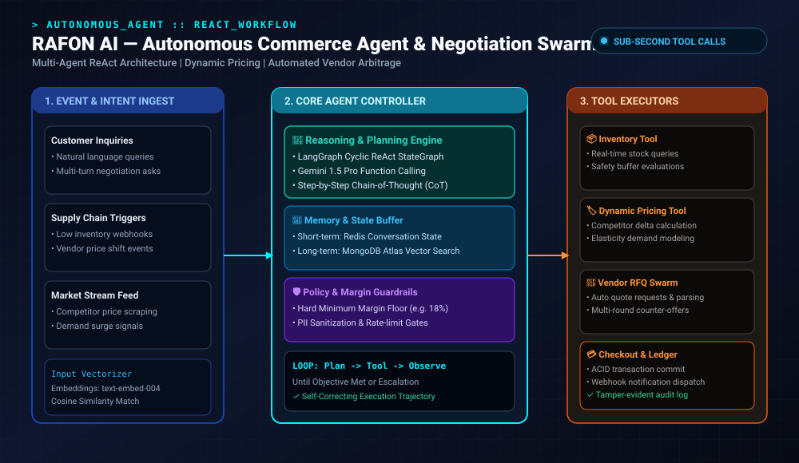
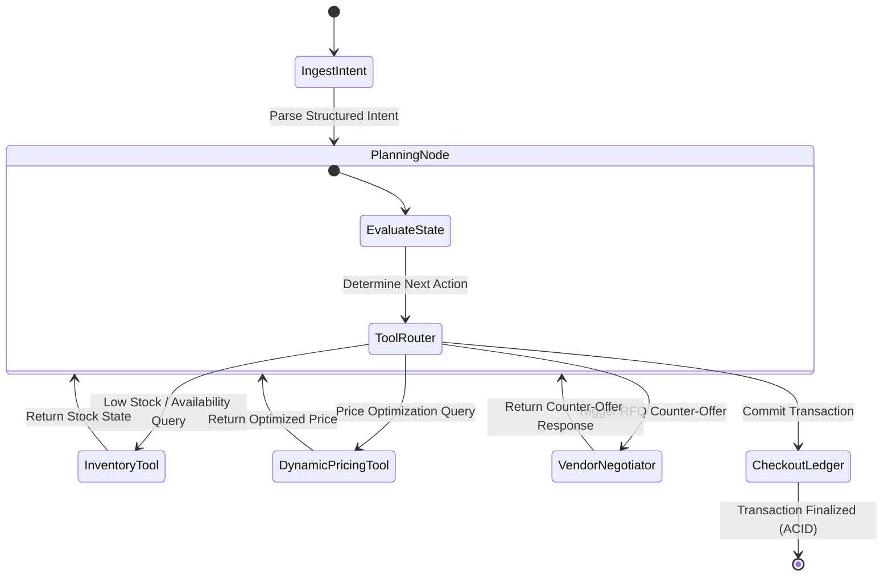

<div align="center">

# 🤖 RAFON AI — Autonomous Multi-Agent Commerce & Negotiation Swarm

**Next-Generation Autonomous E-Commerce Intelligence, ReAct Multi-Agent Orchestration & Real-Time Dynamic Pricing**

[](https://github.com/nleelaranga-ai/RAFON-AI-Commerce-Agent)
[](https://www.python.org)
[](https://langchain-ai.github.io/langgraph/)
[](https://ai.google.dev)
[](https://redis.io)
[](LICENSE)

<br />



</div>

---

## 📑 Executive Summary

Modern enterprise commerce platforms struggle with static pricing models, manual vendor negotiations, and fragmented inventory replenishment workflows. These inefficiencies cause **stock-outs, compressed operating margins, and lost sales velocity**.

**RAFON AI** is an autonomous multi-agent commerce system built on a cyclic **ReAct (Reasoning + Acting) StateGraph**. Powered by **Gemini 1.5 Pro** and **LangGraph**, the agent autonomously reasons through customer purchasing intent, evaluates competitor price movements, triggers supplier RFQ (Request For Quotation) counter-offers, and executes dynamic markdown schedules while strictly enforcing profit margin guardrails.

---

## 🎯 Problem Statement

* **Static Pricing Bottlenecks**: Retailers lose up to 12% in revenue due to delayed reactions to competitor discounts and sudden inventory imbalances.
* **Manual Procurement Cycles**: Sourcing inventory and counter-negotiating vendor quotes takes days of email exchanges, leading to supply bottlenecks.
* **Hallucination Risks in Autonomous Checkout**: Traditional LLMs lack deterministic guardrails, risking unauthorized discounts and broken transactional states.

---

## 🏛️ Autonomous ReAct Architecture

RAFON AI uses **LangGraph** to model stateful, multi-actor conversations where each agent node possesses specialized tools and access to shared memory:



---

## 🧮 Mathematical & Algorithmic Formulation

### 1. Dynamic Pricing Model with Elasticity

The agent optimizes prices by estimating the **Price Elasticity of Demand ($E_d$)**:

$$E_d = \frac{\% \Delta Q}{\% \Delta P} = \frac{(Q_1 - Q_0) / Q_0}{(P_1 - P_0) / P_0}$$

The dynamic price $P^*$ is computed subject to competitor price $P_{\text{comp}}$, inventory velocity $V_{\text{inv}}$, and a strict gross margin floor $M_{\text{floor}}$:

$$P^* = \max\left(C \times (1 + M_{\text{floor}}), \; P_{\text{base}} \times \left(1 + \alpha \cdot \frac{P_{\text{comp}} - P_{\text{base}}}{P_{\text{base}}}\right) \times \left(1 + \beta \cdot (1 - V_{\text{inv}})\right)\right)$$

Where:
* $C$: Unit Acquisition Cost
* $M_{\text{floor}}$: Hard minimum profit margin (e.g., $0.18$ for 18%)
* $\alpha \in [0, 1]$: Competitor price sensitivity weighting
* $\beta \in [0, 1]$: Inventory age decay coefficient

### 2. Autonomous Vendor Counter-Offer Scoring
When negotiating with suppliers, the agent uses a concession decay function to formulate counter-offers across $k$ rounds:

$$O_k = O_{\text{target}} + (O_{\text{initial}} - O_{\text{target}}) \cdot \left(1 - \frac{k}{K_{\max}}\right)^\gamma$$

Where $\gamma$ controls the agent's negotiation concession rate (aggressive vs cooperative).

---

## 📂 Project Repository Structure

```
RAFON-AI-Commerce-Agent/
├── .github/workflows/ci.yml          # Automated CI pipeline
├── src/
│   ├── agents/
│   │   ├── coordinator.py            # LangGraph Master StateGraph
│   │   ├── pricing_agent.py          # Elasticity & dynamic pricing engine
│   │   ├── negotiation_agent.py      # Multi-turn vendor RFQ negotiator
│   │   └── inventory_agent.py        # Safety stock & demand forecaster
│   ├── memory/
│   │   ├── redis_state.py            # Short-term thread session buffer
│   │   └── vector_store.py           # MongoDB / Chroma long-term memory
│   ├── tools/
│   │   ├── competitor_scraper.py     # Real-time price telemetry
│   │   ├── ledger_tool.py            # PostgreSQL transactional checkout
│   │   └── erp_connector.py          # SAP / Shopify webhook adapter
│   ├── core/
│   │   ├── config.py                 # Pydantic v2 settings & secrets
│   │   └── guardrails.py             # Minimum margin & PII filter
│   └── api/
│       ├── main.py                   # FastAPI REST & WebSocket server
│       └── schemas.py                # Request/Response contracts
├── tests/
│   ├── test_agent_graph.py           # Deterministic state execution tests
│   └── test_pricing_math.py          # Elasticity boundary condition tests
├── docker-compose.yml
├── requirements.txt
└── README.md
```

---

## ⚡ Quickstart & Installation

```bash
# Clone repository
git clone https://github.com/nleelaranga-ai/RAFON-AI-Commerce-Agent.git
cd RAFON-AI-Commerce-Agent

# Setup environment
python -m venv venv
source venv/bin/activate  # On Windows: venv\Scripts\activate
pip install -r requirements.txt

# Configure environment variables
cp .env.example .env
# Set GEMINI_API_KEY, REDIS_URL, and DATABASE_URL

# Launch the FastAPI orchestration server
uvicorn src.api.main:app --host 0.0.0.0 --port 8000 --reload
```

---

## 🔌 API Reference & Usage

### 1. Trigger Agent Negotiation / Pricing Task
```bash
curl -X POST "http://localhost:8000/api/v1/agent/execute" \
  -H "Content-Type: application/json" \
  -d '{
    "task": "OPTIMIZE_AND_NEGOTIATE",
    "product_id": "SKU-9021",
    "competitor_price": 249.99,
    "inventory_level": 420,
    "current_cost": 170.00,
    "target_margin": 0.22
  }'
```

**Response (`200 OK`)**:
```json
{
  "task_id": "task_8a92b3c1",
  "status": "RESOLVED",
  "execution_trajectory": [
    {"node": "InventoryTool", "observation": "Stock sufficient for 14 days"},
    {"node": "DynamicPricingTool", "recommended_price": 234.99, "projected_margin": "27.6%"},
    {"node": "VendorNegotiator", "vendor_id": "SUPPLIER_V2", "accepted_unit_cost": 158.50}
  ],
  "final_decision": {
    "action": "UPDATE_LISTING_AND_REORDER",
    "new_retail_price": 234.99,
    "reorder_quantity": 500,
    "estimated_revenue_gain": "+14.2%"
  }
}
```

---

## 🗺️ Engineering Roadmap

- [x] **Milestone 1**: Core LangGraph cyclic state machine with Gemini 1.5 Pro function calling.
- [x] **Milestone 2**: Dynamic elasticity pricing module with margin safety guardrails.
- [x] **Milestone 3**: Redis session state caching and vector memory integration.
- [ ] **Milestone 4 (Q3 2026)**: Multi-agent coalition bargaining (buyer agent vs supplier agent).
- [ ] **Milestone 5 (Q4 2026)**: Production Shopify and WooCommerce app store connectors.

---

## 📜 License & Author

Distributed under the **MIT License**.  
**Author**: **LEELA RANGA PRASAD** (`nleelaranga-ai`) • [LinkedIn](https://linkedin.com/in/leela-ranga-prasad-ba4936214) • [Email](mailto:n.leelaranga@gmail.com)
