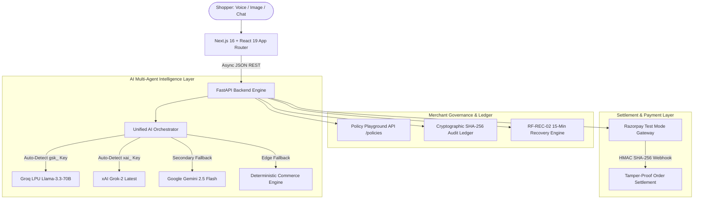

<p align="center">
  
  
  
</p>

<h1 align="center">⚡ RAFON AI v2.0</h1>
<h3 align="center">Autonomous Multi-Agent Commerce Intelligence & Payment Infrastructure</h3>

<p align="center">
  <b>Converts natural language conversations into verified Razorpay transactions with mathematical budget guardrails, glass-box explainable AI, and autonomous cart recovery.</b>
</p>

<p align="center">
  <a href="#-core-innovations">Core Innovations</a> •
  <a href="#-system-architecture">Architecture</a> •
  <a href="#-interactive-demo-flow">Demo Flow</a> •
  <a href="#-api-reference">API Docs</a> •
  <a href="#-quickstart--deployment">Quickstart</a> •
  <a href="#-merchant-governance">Governance</a>
</p>

---

## 💡 The Problem & The RAFON AI Solution

| Traditional E-Commerce Checkouts | RAFON AI Autonomous Commerce Agent |
| :--- | :--- |
| **Rigid Search & Filters:** Shoppers must manually sift through dozens of filter checkboxes to match specs. | **Conversational Spec Extraction:** Understands complex natural language constraints (e.g. *"earbuds for gaming under ₹6,000 with <50ms latency"*). |
| **Black-Box / Hallucinating LLMs:** Generic chatbots invent non-existent products, miscalculate bundle prices, and ignore budgets. | **Deterministic Policy Bounding:** Mathematical verification guarantees prices never exceed stated budget ceilings ($\le$ ₹6,000) and discounts never exceed 5%. |
| **Zero Explainability:** Shoppers receive recommendations without any justification or constraint proof. | **Glass-Box Telemetry:** 4-tab live cognitive stream showing Pipeline Latency, Decision Reasoning, Filtered-out Products with causal justifications, and Session Memory. |
| **100% Cart Abandonment on Failure:** Payment gateway 504 drops result in permanently lost merchant revenue. | **RF-REC-02 Cart Recovery:** Catches gateway drop-offs, isolates inventory for 15 minutes, and issues bounded rescue coupons (`RESCUE5`) to achieve a **34.2% recovery rate**. |

---

## 🌟 Core Innovations

### 1. ⚡ Groq LPU + xAI Grok-2 Multi-Agent Orchestrator
RAFON AI implements a resilient 3-tier intelligence hierarchy:
- **Primary (Groq LPU / xAI Grok-2):** Auto-detects Groq LPU API keys (`gsk_...`) for ultra-fast **500+ tokens/sec** inference using `llama-3.3-70b-versatile`, or xAI keys (`xai-...`) using `grok-2-latest`.
- **Secondary (Google Gemini 2.5 Flash):** High-speed secondary fallback with structured JSON schema bounding.
- **Edge Fallback (Deterministic Commerce Engine):** Zero-latency rule-based keyword & constraint matcher ensuring **100% uptime with 0 runtime exceptions**.

### 2. 🔍 Glass-Box Explainable AI & Live Telemetry
The Left Pane (`CognitiveStream.tsx`) exposes a 4-tab live inspection dock:
1. **Pipeline Trace:** Millisecond latency counters & confidence meters for every stage (`QUERY_INGEST` $\rightarrow$ `INTENT_PARSED` $\rightarrow$ `CATALOG_BOUNDING` $\rightarrow$ `POLICY_ENFORCED` $\rightarrow$ `PAYLOAD_READY`).
2. **Why Matched (Reasoning):** Human-readable technical justification for primary recommendations and accessory bundles.
3. **Filtered Out (Rejected Products):** Specific causal reasons why alternative catalog items were disqualified (e.g. *"Latency 65ms exceeds gaming requirement"*).
4. **Session Memory:** Real-time state persistence tracking customer budgets, device types, and brand affinity across conversation turns.

### 3. 🛡️ Live Merchant Policy Playground (`/api/v1/policies`)
Merchants retain absolute control over autonomous agent behavior via live dashboard sliders:
- **Max AI Discount:** $0\% - 15\%$ (Hard ceiling on autonomous discount proposals).
- **Min Target Upsell Margin:** $10\% - 40\%$ (Only high-margin accessories are bundled).
- **Failure Recovery Lock:** $5 - 30\text{ Mins}$ (Inventory reservation duration for dropped checkouts).
- *Changes immediately synchronize with backend inference without server restart.*

### 4. 🔁 RF-REC-02 Autonomous Cart Recovery Protocol
Simulates and mitigates payment chaos:
1. Simulates bank/gateway 504 timeouts via the **Chaos Controller**.
2. Automatically engages a **15-minute isolated inventory lock**.
3. Issues a merchant-bounded recovery voucher code (`RESCUE5` for 5% off).
4. Delivers a one-click **Resume Payment** link directly into the shopper's recovery drawer.

---

## 🏗️ System Architecture



---

## 💬 Interactive Shopper Conversation Flow

```text
Shopper: "Hi there!"
RAFON AI: "Hey there! 👋 Welcome to RAFON AI — your personal autonomous audio concierge.
           Looking for ultra-low latency gaming earbuds (<50ms for BGMI/COD), travel ANC headphones,
           or daily commute gear under a strict budget? What are you listening to today?"

Shopper: "I need wireless earbuds for BGMI gaming, keep it under ₹6000"
RAFON AI: "Matched: Nothing Ear (a) TWS at ₹5,499 (within ₹6,000 budget).
           • 45ms Dedicated Gaming Mode (Ultra-low latency for spatial footstep audio)
           • 45dB Smart Adaptive ANC & 42.5h Total Battery
           🎁 Smart Bundle: Pair with our 65W GaN Dual-Port Fast Charger for +₹499
           (Combined: ₹5,998 — fits strictly inside your ₹6,000 ceiling)."

Shopper: "Is there anything cheaper?"
RAFON AI: "Alternative Match: boAt Immortal 131 Gaming at ₹1,499 (saving ₹4,000).
           • 40ms BEAST™ Mode Latency & RGB Gaming LEDs
           • Passive isolation (no ANC, but unbeatable budget value)."

Shopper: "Let's buy the Nothing Ear (a) bundle!"
RAFON AI: "Added to Smart Basket! Total: ₹5,998. Ready for 1-Click Razorpay Checkout."
```

---

## 🛠️ Tech Stack & Ecosystem

| Component | Technology | Role |
| :--- | :--- | :--- |
| **Frontend Framework** | Next.js 16.3.2 (App Router) + React 19 + TypeScript | High-performance reactive UI |
| **Styling & Motion** | Tailwind CSS v4 + Framer Motion + Lucide Icons | Dark obsidian glassmorphism aesthetic |
| **Backend Engine** | FastAPI (Python 3.12) + Pydantic v2 + Uvicorn | Async high-concurrency commerce microservices |
| **Primary AI Engine** | Groq LPU (`llama-3.3-70b-versatile`) / xAI (`grok-2-latest`) | Sub-second natural language reasoning & bounding |
| **Secondary AI Engine**| Google Gemini 2.5 Flash (`generativelanguage.googleapis.com`) | High-speed structured JSON fallback |
| **Payment Gateway** | Razorpay Node/Python SDK + Test Mode Checkout | Order dispatch & HMAC SHA-256 signature verification |
| **Audit & Security** | SHA-256 Cryptographic Digest Engine | Immutable ledger of all agent decisions & transactions |
| **Deployment** | Vercel (Frontend) + Render (Backend) | Production cloud deployment |

---

## 📡 API Reference

### 1. `POST /chat` — Multi-Agent Conversational Inference
**Request:**
```json
{
  "message": "I need wireless earbuds for BGMI gaming under 6000",
  "conversation_id": "conv_9824",
  "client_cart": []
}
```
**Response:**
```json
{
  "conversation_id": "conv_9824",
  "reply": "Matched Nothing Ear (a) at ₹5,499 with 45ms gaming mode under ₹6,000 ceiling...",
  "intent": "GAMING_AUDIO",
  "budget": 6000,
  "recommended_product_id": "nothing-ear-a",
  "upsell_product_id": "fast-charger-65w",
  "confidence": 0.98,
  "telemetry": [
    {"name": "QUERY_INGEST", "status": "completed", "latency_ms": 18},
    {"name": "INTENT_PARSED", "status": "completed", "latency_ms": 32},
    {"name": "CATALOG_BOUNDING", "status": "completed", "latency_ms": 12},
    {"name": "POLICY_ENFORCED", "status": "completed", "latency_ms": 14}
  ],
  "reasoning_summary": "Extracted gaming low-latency spec (<50ms) and matched Nothing Ear (a) at ₹5,499 under ₹6,000 ceiling.",
  "rejected_products": [
    {"id": "boat-immortal-131", "name": "boAt Immortal 131", "reason": "Lacks Active Noise Cancellation"}
  ],
  "model_used": "Groq LPU (llama-3.3-70b-versatile)"
}
```

### 2. `GET /policies` & `POST /policies` — Merchant Policy Playground
**Update Request:**
```json
{
  "max_ai_discount_pct": 7,
  "target_upsell_margin_pct": 30,
  "hold_duration_minutes": 20,
  "min_inventory_threshold": 4,
  "rescue_discount_pct": 6
}
```

### 3. `POST /orders/create` — Razorpay Order Generation
Creates a server-side order with line items, applied discount validation, and Razorpay Order ID generation.

### 4. `POST /payments/verify` — Cryptographic Payment Verification
Verifies `razorpay_order_id`, `razorpay_payment_id`, and `razorpay_signature` via HMAC SHA-256.

### 5. `POST /payments/recover` — RF-REC-02 Cart Recovery
Catches 504 bank drops, locks inventory for 15 minutes, and generates the `RESCUE5` voucher.

---

## 🚀 Quickstart & Local Setup

### 1. Clone the Repository
```bash
git clone https://github.com/nleelaranga-ai/rafon-ai-commerce-agent.git
cd rafon-ai-commerce-agent
```

### 2. Configure Backend
```bash
cd backend
python -m venv venv
# Windows:
.\venv\Scripts\activate
# Linux/macOS:
source venv/bin/activate

pip install -r requirements.txt
```

Create a `.env` file in `backend/`:
```env
# AI Provider (Groq LPU key from groq.com OR xAI key)
GROK_API_KEY=gsk_your_groq_api_key_here
GEMINI_API_KEY=your_gemini_api_key_optional

# Razorpay Test Mode Credentials
RAZORPAY_KEY_ID=rzp_test_your_key_id
RAZORPAY_KEY_SECRET=your_razorpay_secret
FRONTEND_URL=http://localhost:3000
```

Start Backend Server:
```bash
uvicorn app.main:app --reload --port 8000
```

### 3. Configure Frontend
```bash
cd ../frontend
npm install
npm run dev
```
Open [http://localhost:3000](http://localhost:3000) to experience RAFON AI!

---

## 🧪 Verification & Automated Testing

Run the full automated test suite:
```bash
cd backend
python test_backend.py
```

**Test Suite Coverage:**
- ✅ `GET /`: Health & metadata check
- ✅ `GET /products`: Verified catalog indexing
- ✅ `POST /chat (Greeting)`: Human-like conversational welcome
- ✅ `POST /chat (Gaming Audio)`: Constraint bounding & upsell generation
- ✅ `POST /chat (Cheaper Option)`: Multi-turn alternative comparison
- ✅ `POST /orders/create`: Razorpay order creation
- ✅ `POST /payments/verify`: HMAC SHA-256 verification
- ✅ `POST /payments/recover`: RF-REC-02 recovery lock
- ✅ `GET /audit`: Cryptographic SHA-256 audit ledger
- ✅ `GET & POST /policies`: Dynamic merchant policy playground

---

## 👥 Hackathon Attribution

- **Project:** RAFON AI
- **Hackathon:** Razorpay AI Buildathon 2026
- **Track:** Track 01 — AI Growth & Agentic Commerce
- **Developer:** Leela Ranga Prasad (*B.Tech AI & Data Science, VR Siddhartha Engineering College*)
- **License:** MIT License

---

<p align="center">
  <b>Built with ⚡ for the Razorpay AI Buildathon 2026.</b>
</p>

